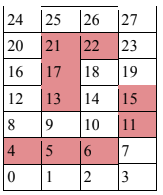
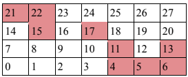
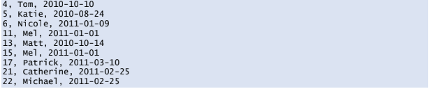
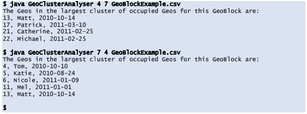

# Geo Clusters
A rectangular grid is overlaid on a piece of a map such that the map is divided up into squares of land. These squares
are called Geos and the encompassing rectangle is called a GeoBlock. Users can purchase these Geos. When they are
purchased, they become “occupied”.

Each Geo has an ID within the GeoBlock, starting from 0 in the bottom-left corner, moving left to right along the
bottom row, then up to the next row, left to right along that and so on until the top right Geo is reached.

Below is an example GeoBlock. The occupied Geos are shown in red:

A Geo Cluster is defined as being a set of occupied Geos where each one is adjacent to (i.e. directly above, below, or
to the left or right of) one or more other occupied Geos.

The clusters in the example above are:

- 4, 5 and 6
- 11 and 15
- 13, 17, 21 and 22

Note that another GeoBlock with the same number of Geos and occupied Geo IDs, but different dimensions (7x4
instead of 4x7) has different clusters:

The clusters in this GeoBlock are:
- 4, 5, 6, 11 and 13
- 15, 21 and 22
- 17

Occupied Geos are specified using an ASCII CSV file format. Each line contains the following fields:
Geo ID, Occupier’s username, Date the Geo was occupied from in YYYY-MM-DD format

The CSV in this example looks like:

## Task
Write a command-line program in Java that takes three parameters:
- Width of GeoBlock (in number of Geos)
- Height of GeoBlock (in number of Geos)
- Name of the CSV file that defines the occupied Geos for that GeoBlock
It should output the details of the Geos in the cluster with the largest number of Geos in it. The details should
include all the information about the Geos that was available in the CSV. Thus, using the example set of Geo Ids
above, assuming the main() method of your program is in a class called GeoClusterAnalyser, the output should be:

In the event that there is more than one cluster with the largest size, details of the cluster with the lowest sum of
Geo IDs should be returned. So for example if there was a GeoBlock with two clusters (4, 8, 12) and (6, 7, 10), then
details of the (6, 7, 10) cluster would be returned as (6+7+10) < (4+8+12).

## Notes
- Your code should produce correct answers in under a second for a 10,000 x 10,000 Geo GeoBlock containing
10,000 occupied Geos.
- Your code needs to be ‘production quality’: it should be clear, easy to follow and maintainable. It should also
have good error handling - including being able to tell the end user whether and exactly where in the CSV
input there is an error (eg line too short or too long or invalid value).
